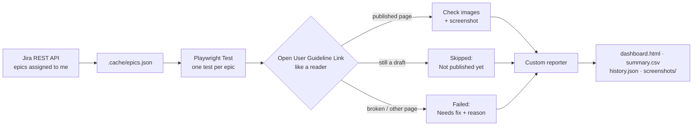

# Guideline Tracker

**Playwright + TypeScript automation that checks whether every feature I document has a published, working user guideline, and turns the result into a dashboard.**

<sub>All data in the screenshots is fictional (generated by `npm run demo:dashboard`).</sub>

---

## Why

Every sprint, each new feature gets a user guideline in the team knowledge base (BookStack), and the Jira epic links to it. Before release, someone has to confirm that, for every epic:

- the guideline page exists and is **published** (not still a draft)
- the epic's **User Guideline Link** opens that page
- every **image** on the page still loads

With 10+ epics per sprint that is a slow, error-prone manual cross-check between two systems. This project does it in one command:

```bash
npm run check
```

```text
Running 8 tests using 4 workers
  ✓  DOC-1201 Bulk User Import from CSV
  ✓  DOC-1208 Two-Factor Login for Admin Panel
  ✘  DOC-1229 Audit Log Filters
  ✘  DOC-1236 Role-Based Access for Support Team
  -  DOC-1250 Dark Mode for Dashboard
  …
Needs attention:
  DOC-1229  1 broken image(s)
  DOC-1236  epic link points to another page: https://kb.example.com/books/release-guides/page/doc-1201-…

Guideline progress: 5/8 epics complete (63%), 1 not published yet, 2 need fixes.
Dashboard: reports/dashboard.html
```

<sub>Output of `npm run check:demo` (fictional data).</sub>

## Try it in 1 minute (no accounts needed)

```bash
npm install
npx playwright install chromium
npm run check:demo        # runs the full test suite on anonymised sample data
npm run demo:dashboard    # builds a shareable dashboard with fictional data
```

Open `reports/dashboard.html` (or `reports-demo/dashboard.html`) in any browser.

## How it works



1. **Fetch.** `scripts/fetch-jira.ts` pulls every issue assigned to the current user (`currentUser()` in JQL), groups them by epic and saves them. Playwright builds its test list from that file.
2. **Check.** Each epic is one Playwright test with clear steps:

   | Step | Passes when | Otherwise |
   |------|-------------|-----------|
   | User Guideline Link | It opens a **published** page whose title starts with the epic key | Draft → *Not published yet* (skipped) · broken link or another epic's page → **fail** |
   | Fallback search | Without a link, a page titled `<EPIC-KEY> …` is found | *Not published yet* |
   | Child issues | Each child has a link (QA / UI-UX tasks ignored) | Warning (or fail with `REQUIRE_CHILD_LINKS=true`) |
   | Images | Every image URL on the page is served | **fail**, listing the broken images |
   | Evidence | A screenshot of the page is saved | — |

3. **Report.** A custom Playwright reporter writes the dashboard, a CSV, raw JSON and a history file for the trend line. The terminal ends with a *Needs attention* list giving the reason for every failure.

Each epic ends up as **Complete**, **Not published yet**, **Needs fix** or **Check error** (the check itself could not run, e.g. an expired login).

## Design decisions

- **A red test always means "fix something".** Unfinished work is a status, not a failure, so unpublished guidelines are skipped. Set `STRICT=true` to make them fail.
- **Check like a reader.** The link from Jira is opened in a real browser, so draft URLs, redirects and permissions behave exactly as they do for users.
- **No false alarms from lazy loading.** Images are verified by requesting each URL, not by waiting for them to render.
- **No passwords in the code.** Use API tokens, or log in once in a real browser and the session is saved locally. Before each run the session is checked; if it has expired, a browser opens so you can log in again, and the run continues.
- **Resilient to Jira changes.** Custom fields are looked up by name (`User Guideline Link`, `Sprint`), not by hard-coded ID.
- **Shareable.** `demo:dashboard` produces a dashboard and screenshots from fictional data, so results can be shown publicly without exposing anything internal.

## Setup with your own Jira and BookStack

```bash
cp .env.example .env
```

| Setting | Purpose |
|---------|---------|
| `JIRA_BASE_URL` · `JIRA_EMAIL` · `JIRA_API_TOKEN` | Jira Cloud access ([create a token](https://id.atlassian.com/manage-profile/security/api-tokens)) |
| `JIRA_JQL` | Which issues to track. Default: `"User Guideline" = currentUser()` |
| `JIRA_GUIDELINE_LINK_FIELD` · `JIRA_SPRINT_FIELD` | Field names, resolved to IDs automatically |
| `SPRINT_FILTER` | Only epics whose sprint contains this text, e.g. `November 2026` |
| `BOOKSTACK_URL` | Knowledge base URL |
| `BOOKSTACK_TOKEN_ID` · `BOOKSTACK_TOKEN_SECRET` | Optional API token. Without it, a saved browser session is used (`npm run login bookstack`) |
| `CHECK_IMAGES` · `SCREENSHOTS` · `FULL_PAGE_SCREENSHOTS` | Image check and page screenshots |
| `REQUIRE_CHILD_LINKS` · `STRICT` | How strict the run is |

```bash
npm run check     # fetch Jira, check every epic, write the reports
npm run report    # open the Playwright HTML report (steps, screenshots, traces)
```

### Output (`reports/`)

| File | Contents |
|------|----------|
| `dashboard.html` | Completion %, trend line, filters, search, screenshot thumbnails, problems per epic |
| `screenshots/<KEY>.png` | Evidence of each guideline page |
| `summary.csv` | For Excel / Google Sheets |
| `summary.json` · `history.json` | Raw results and progress over time ("completed since last run") |
| `html/` | Playwright HTML report |

### Run it on a schedule

`.github/workflows/guideline-progress.yml` runs the check every weekday morning on GitHub Actions and uploads the reports as an artifact (add the `.env` values as repository secrets). On Windows, `npm run check` can also be scheduled with Task Scheduler.

## Project layout

```
scripts/fetch-jira.ts             step 1: pull assigned issues from Jira, group by epic
scripts/login.ts                  save a browser session (BookStack / Jira)
scripts/demo-dashboard.ts         shareable dashboard with fictional data
tests/guideline-progress.spec.ts  step 2: one Playwright test per epic
reporters/summary-reporter.ts     dashboard, CSV, JSON, history, "Needs attention"
src/jira.ts                       Jira REST client (pagination, field lookup by name)
src/bookstack.ts                  link resolution, search, image checks
src/session.ts                    session check and re-login before a run
src/config.ts                     settings from .env with early validation
mock/epics.json                   anonymised data for check:demo
```

## Tech

Playwright Test · TypeScript · Playwright `APIRequestContext` for REST calls · Jira Cloud REST API v3 · BookStack · custom Playwright reporter · GitHub Actions
